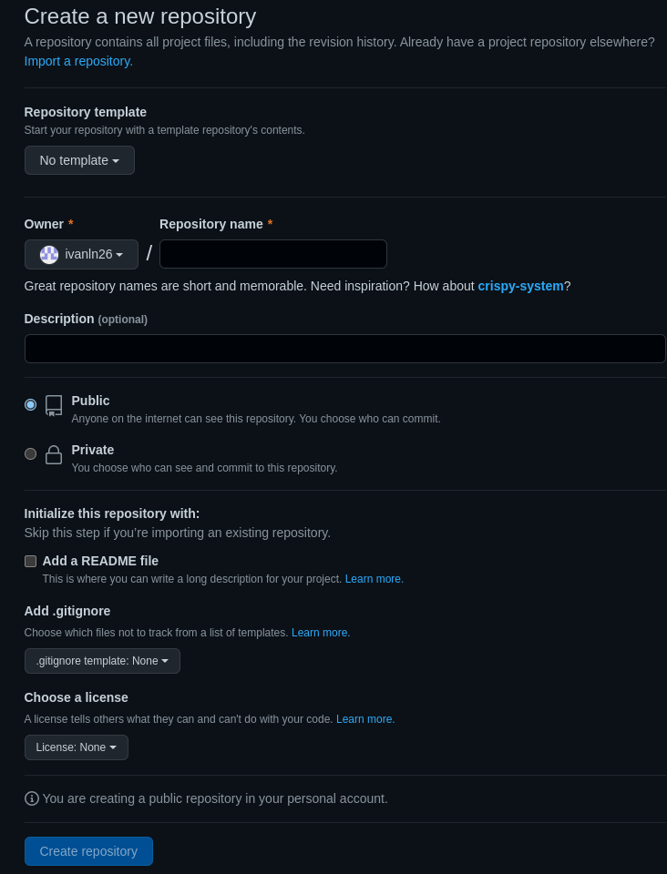
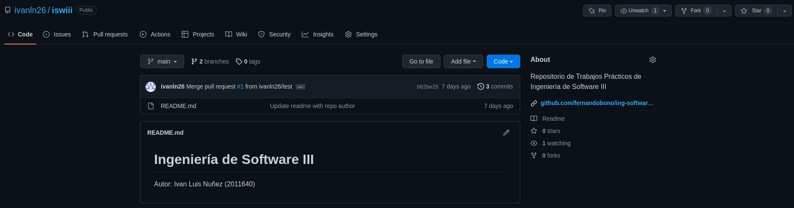
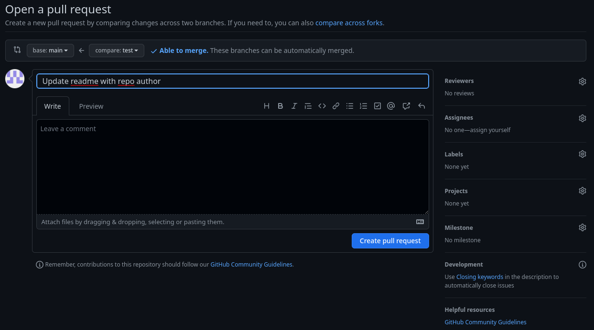
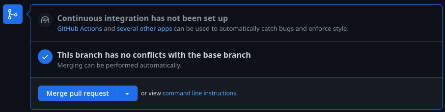
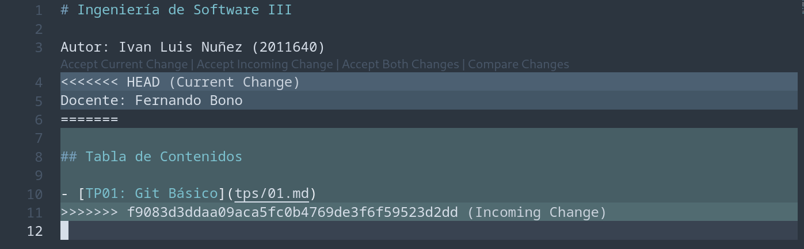
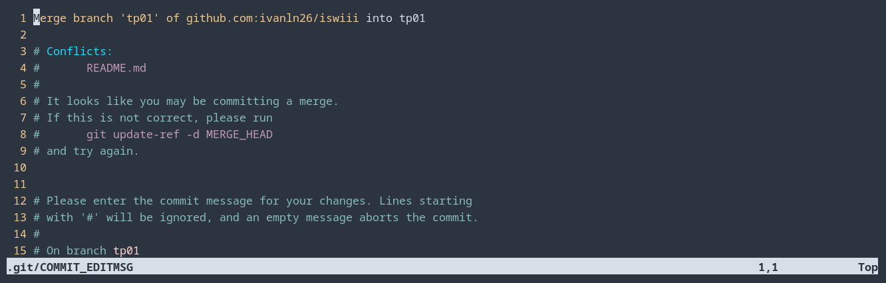
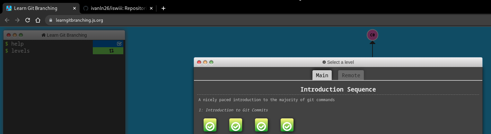

# Trabajo Práctico N°1 - Git Básico

## Unidad 01: Git Básico

### Ejercicio 2

```console
$ mkdir repositorio
$ cd repositorio
$ git init
Initialized empty Git repository in /home/ivanln/documents/iswiii/.git/
$ touch README.md
$ echo "Ingeniería de Software III" > README.md
$ git add README.md
$ git commit -m "Start project with readme"
[main (root-commit) 8b4d8a7] Start project with readme
 1 file changed, 1 insertion(+)
 create mode 100644 README.md
```

### Ejercicio 3



```console
$ git remote add origin git@github.com:ivanln26/iswiii.git
$ git push origin main
Enumerating objects: 3, done.
Counting objects: 100% (3/3), done.
Writing objects: 100% (3/3), 258 bytes | 258.00 KiB/s, done.
Total 3 (delta 0), reused 0 (delta 0), pack-reused 0
To github.com:ivanln26/iswiii.git
 * [new branch]      main -> main
branch 'main' set up to track 'origin/main'.
```



### Ejercicio 4

**Pull Request (PR)**: permite notificar a otros sobre cambios que se realizaron
sobre una rama en un repositorio de GitHub. Se crea un espacio (foro) de
discusión sobre los cambios realizados para que los demás integrantes del 
repositorio puedan revisar/aprobar/rechazar/pedir cambios, antes de hacer un
`merge` sobre la rama `base` (destino).

*Estados de PRs*:

- Open
- Closed

```console
$ git branch test
$ git checkout test
Switched to branch 'test'
$ echo "# Ingeniería de Software III\nAutor: Ivan L. Nuñez (2011640)" > README.md
$ git add README.md
$ git commit -m "Update readme with repo author"
```






### Ejercicio 5

```console
ivanln@laptop:~$ git clone git@github.com:ivanln26/iswiii.git iswiii-conflictivo
ivanln@laptop:~ $ cd iswiii
ivanln@laptop:~/iswiii $ echo "\n## Tabla de Contenidos\n- [TP01: Git Básico](tps/01.md)" >> README.md
ivanln@laptop:~/iswiii $ cd ../iswiii-conflictivo
ivanln@laptop:~/iswiii-conflictivo $ echo "\nDocente: Fernando Bono" >> README.md
ivanln@laptop:~/iswiii-conflictivo $ git commit -a -m "Add professor's name"
ivanln@laptop:~/iswiii-conflictivo $ git push origin tp01
To github.com:ivanln26/iswiii.git
 ! [rejected]        tp01 -> tp01 (fetch first)
error: failed to push some refs to 'github.com:ivanln26/iswiii.git'
ivanln@laptop~/iswiii-conflictivo $ git pull origin tp01
```




```console
ivaln@laptop:~/iswiii-conflictivo $ git push origin tp01
```

<!-- TODO: Explicar las versiones LOCAL, BASE y REMOTE. -->

## Ejercicio 6


