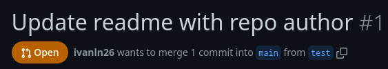

# Trabajo Práctico N°1 - Git Básico

## Unidad 01: Git Básico

### Ejercicio 2

```console
$ mkdir repositorio
$ cd repositorio
$ git init
Initialized empty Git repository in /home/ivanln/documents/iswiii/.git/
$ touch README.md
$ echo "Ingeniería de Software III" > README.md
$ git add README.md
$ git commit -m "Start project with readme"
[main (root-commit) 8b4d8a7] Start project with readme
 1 file changed, 1 insertion(+)
 create mode 100644 README.md
```

### Ejercicio 3

<!--- TODO: add github repo creation image. --->
<!--- TODO: add github repo populated image. --->

```console
$ git remote add origin git@github.com:ivanln26/iswiii.git
$ git push origin main
Enumerating objects: 3, done.
Counting objects: 100% (3/3), done.
Writing objects: 100% (3/3), 258 bytes | 258.00 KiB/s, done.
Total 3 (delta 0), reused 0 (delta 0), pack-reused 0
To github.com:ivanln26/iswiii.git
 * [new branch]      main -> main
branch 'main' set up to track 'origin/main'.
```

### Ejercicio 4

<!--- TODO: explain what a PR is --->
<!--- TODO: add GitHub PR image --->





```console
$ git branch test
$ git checkout test
Switched to branch 'test'
$ echo "# Ingeniería de Software III\nAutor: Ivan L. Nuñez (2011640)" > README.md
$ git add README.md
$ git commit -m "Update readme with repo author"
```
