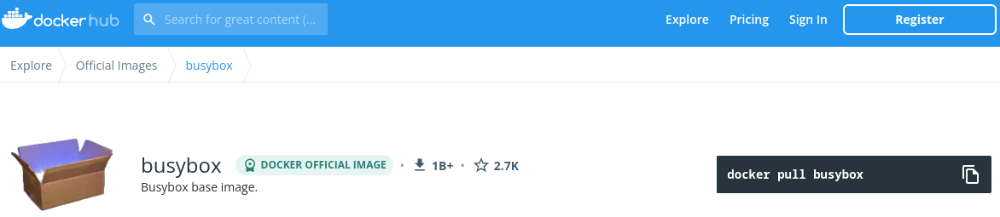
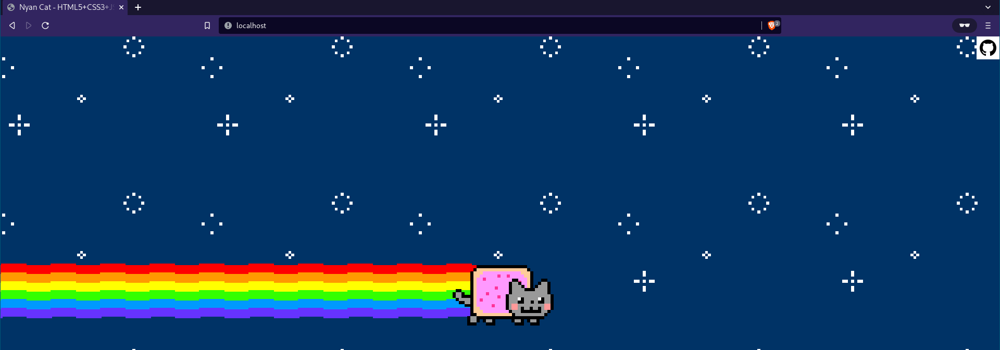

# Trabajo Práctico N°2 - Introducción a Docker

## Unidad 02: Introducción a Docker

### Ejercicio 1

```console
$ docker version
Client:
 Version:           20.10.17
 API version:       1.41
 Go version:        go1.18.3
 Git commit:        100c70180f
 Built:             Sun Jun 12 02:45:06 2022
 OS/Arch:           linux/amd64
 Context:           default
 Experimental:      true

Server:
 Engine:
  Version:          20.10.17
  API version:      1.41 (minimum version 1.12)
  Go version:       go1.18.3
  Git commit:       a89b84221c
  Built:            Sun Jun 12 02:44:41 2022
  OS/Arch:          linux/amd64
  Experimental:     false
 containerd:
  Version:          v1.6.8
  GitCommit:        9cd3357b7fd7218e4aec3eae239db1f68a5a6ec6
 runc:
  Version:          1.1.3
  GitCommit:
 docker-init:
  Version:          0.19.0
  GitCommit:        de40ad0
```

### Ejercicio 2



### Ejercicio 3

```console
$ docker pull busybox
Using default tag: latest
latest: Pulling from library/busybox
50783e0dfb64: Pull complete
Digest: sha256:ef320ff10026a50cf5f0213d35537ce0041ac1d96e9b7800bafd8bc9eff6c693
Status: Downloaded newer image for busybox:latest
docker.io/library/busybox:latest
$ docker images
REPOSITORY                  TAG             IMAGE ID       CREATED         SIZE
busybox                     latest          7a80323521cc   2 weeks ago     1.24MB
```

### Ejercicio 4

```console
$ docker run busybox
$ docker run busybox echo "Hola Mundo"
Hola Mundo
$ docker ps
CONTAINER ID   IMAGE     COMMAND   CREATED   STATUS    PORTS     NAMES
$ docker ps -a
CONTAINER ID   IMAGE    COMMAND              CREATED              STATUS                          PORTS     NAMES
6c97b343e70f   busybox  "echo 'Hola Mundo'"  About a minute ago   Exited (0) About a minute ago             serene_einstein
6f02f1f2d01d   busybox  "sh"                 2 minutes ago        Exited (0) 2 minutes ago                  thirsty_beaver
```

### Ejercicio 5

```console
$ docker run -it busybox sh
busybox:/ # ps
PID   USER     TIME  COMMAND
    1 root      0:00 sh
    7 root      0:00 ps
busybox:/ # uptime
 22:34:06 up 10:06,  0 users,  load average: 0.14, 0.15, 0.33
busybox:/ # free
              total        used        free      shared  buff/cache   available
Mem:       16301668     3206040     8614908      222984     4480720    12535204
Swap:             0           0           0
busybox:/ # ls -l /
total 36
drwxr-xr-x    2 root     root         12288 Jul 29 01:32 bin
drwxr-xr-x    5 root     root           360 Aug 12 22:33 dev
drwxr-xr-x    1 root     root          4096 Aug 12 22:33 etc
drwxr-xr-x    2 nobody   nobody        4096 Jul 29 01:32 home
dr-xr-xr-x  362 root     root             0 Aug 12 22:33 proc
drwx------    1 root     root          4096 Aug 12 22:33 root
dr-xr-xr-x   13 root     root             0 Aug 12 22:33 sys
drwxrwxrwt    2 root     root          4096 Jul 29 01:32 tmp
drwxr-xr-x    3 root     root          4096 Jul 29 01:32 usr
drwxr-xr-x    4 root     root          4096 Jul 29 01:32 var
busybox:/ # exit
$
```

### Ejercicio 6

```console
$ docker ps -a
CONTAINER ID   IMAGE    COMMAND              CREATED          STATUS                      PORTS     NAMES
673acae35419   busybox  "sh"                 4 minutes ago    Exited (0) 2 minutes ago              sad_curie
6c97b343e70f   busybox  "echo 'Hola Mundo'"  9 minutes ago    Exited (0) 9 minutes ago              serene_einstein
6f02f1f2d01d   busybox  "sh"                 10 minutes ago   Exited (0) 10 minutes ago             thirsty_beaver
$ docker rm sad_curie
sad_curie
$ docker container prune
Are you sure you want to continue? [y/N] y
Deleted Containers:
6c97b343e70f61bc35fde1e3b19437624ebeeb9773fd106bbbf57d028f23c49b
6f02f1f2d01d67558efc1cfac5f1918fdd78ed46646f2cf2b89fd94e05a16a4b

Total reclaimed space: 0B
```

### Ejercicio 7

```console
$ mkdir test
$ echo "Hello" > test/hello.txt
$ docker run -it -v $(pwd)/test:/var/test --rm busybox sh
busybox:/ # ls -l /var/test
total 4
-rw-r--r--    1 1000     1000             6 Aug 12 22:44 hello.txt
busybox:/ # cat /var/test/hello.txt
Hello
busybox:/ # touch /var/test/nuevo.txt
busybox:/ # exit
$ ls -l test
.rw-r--r-- 6 ckacha 12 Aug 19:44 hello.txt
.rw-r--r-- 0 root   12 Aug 19:50 nuevo.txt
```

### Ejercicio 8

```console
$ docker run -d -p 80:80 daviey/nyan-cat-web
```



```console
$ docker kill infallible_kapitsa
infallible_kapitsa
$ docker rm infallible_kapitsa
infallible_kapitsa
```
