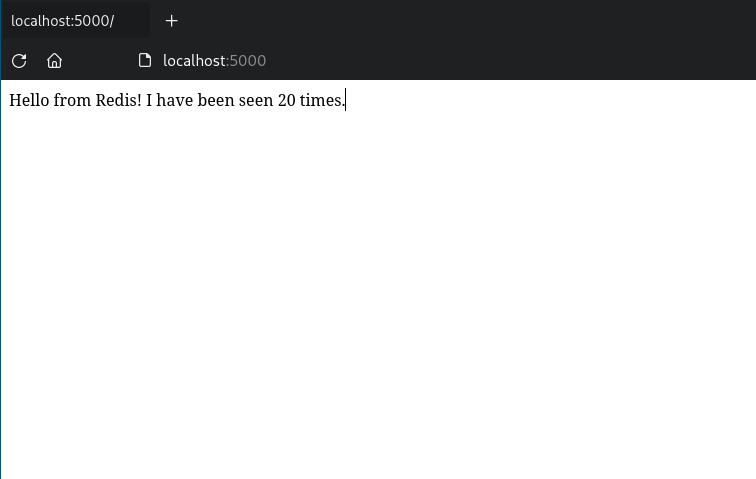
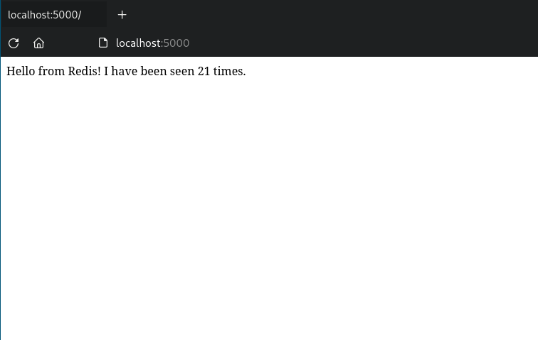
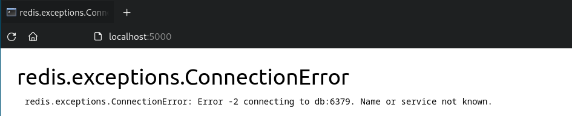
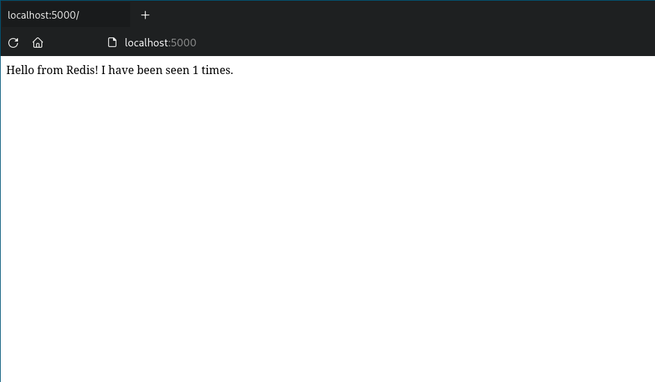
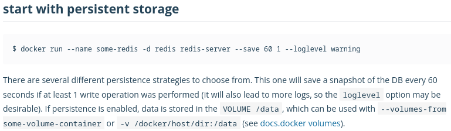

# Trabajo Práctico N°3

## Unidad 03: Arquitectura de Sistemas Distribuidos

### Ejercicio 1

```console
$ docker network create -d bridge mybridge
4cd61bb5edf967bb5f9f256964fd9873ced4bb1015cab42cb7e2ecdd9de59de2
$ docker run -d --net mybridge --name db redis:7.0.4-alpine
cf4b4e9b82dfc7112d22d05b6b5a0004c1c7edb696c5bcd40daff8977d525cf1
$ docker run -d --net mybridge -e REDIS_HOST=db -e REDIS_PORT=6379 -p 5000:5000 --name web alexisfr/flask-app:latest
a0cdde09c12d257ee156586446232d86080dc8cf95886b5241c08ea8a7b51f38
```



```console
$ docker ps
CONTAINER ID   IMAGE                       COMMAND                  CREATED         STATUS          PORTS                                       NAMES
a0cdde09c12d   alexisfr/flask-app:latest   "python /app.py"         2 minutes ago   Up 2 minutes    0.0.0.0:5000->5000/tcp, :::5000->5000/tcp   web
cf4b4e9b82df   redis:7.0.4-alpine          "docker-entrypoint.s…"   5 minutes ago   Up 5 minutes    6379/tcp                                    db
```

Puertos publicados del contenedor al host:
  - 5000

```console
$ docker network inspect mybridge
```

```json
[
    {
        "Name": "mybridge",
        "Id": "4cd61bb5edf967bb5f9f256964fd9873ced4bb1015cab42cb7e2ecdd9de59de2",
        "Created": "2022-08-24T23:44:02.287858497-03:00",
        "Scope": "local",
        "Driver": "bridge",
        "EnableIPv6": false,
        "IPAM": {
            "Driver": "default",
            "Options": {},
            "Config": [
                {
                    "Subnet": "172.25.0.0/16",
                    "Gateway": "172.25.0.1"
                }
            ]
        },
        "Internal": false,
        "Attachable": false,
        "Ingress": false,
        "ConfigFrom": {
            "Network": ""
        },
        "ConfigOnly": false,
        "Containers": {
            "a0cdde09c12d257ee156586446232d86080dc8cf95886b5241c08ea8a7b51f38": {
                "Name": "web",
                "EndpointID": "2a09b2c7b9fa52fa7fdb47d7a2049acc4cf4533e1e3da8b70d50a3b133325656",
                "MacAddress": "02:42:ac:19:00:03",
                "IPv4Address": "172.25.0.3/16",
                "IPv6Address": ""
            },
            "cf4b4e9b82dfc7112d22d05b6b5a0004c1c7edb696c5bcd40daff8977d525cf1": {
                "Name": "db",
                "EndpointID": "acc741250834b6f6b30c0ba9a57d09361584f925cd6ece03f81873f0b1b9f28e",
                "MacAddress": "02:42:ac:19:00:02",
                "IPv4Address": "172.25.0.2/16",
                "IPv6Address": ""
            }
        },
        "Options": {},
        "Labels": {}
    }
]
```

### Ejercicio 2

- El parámetro `-e` se utiliza para setear variables de entorno dentro del
contenedor, para que sean utilizadas como argumentos dentro de la aplicación.
  - `REDIS_HOST`: host donde se encuentra la instancia de redis.
  - `REDIS_PORT`: puerto que utiliza la instancia de redis.
  - `BIND_PORT`: puerto que utilizará la instancia de la aplicación flask.

- Si se remueve el contenedor `web` y se vuelve a levantar, la aplicación
mantiene la cantidad de veces que ha sido accedida.

```console
$ docker rm -f web
web
$ docker run -d --net mybridge -e REDIS_HOST=db -e REDIS_PORT=6379 -p 5000:5000 --name web alexisfr/flask-app:latest
a7b87100810726000ac08fb1079800926e8110207e33347edd8f3981de1a1740
$ docker ps
CONTAINER ID   IMAGE                       COMMAND                  CREATED          STATUS             PORTS                                       NAMES
a7b871008107   alexisfr/flask-app:latest   "python /app.py"         22 seconds ago   Up 21 seconds      0.0.0.0:5000->5000/tcp, :::5000->5000/tcp   web
cf4b4e9b82df   redis:7.0.4-alpine          "docker-entrypoint.s…"   25 minutes ago   Up 25 minutes      6379/tcp                                    db
```



- Si se remueve el contenedor `db` y se refresca la aplicación se produce un
error al intentar realizar una consulta a la conexión de redis.

```console
$ docker rm -f db
db
```



- Si se vuelve a levantar la instancia de redis en el contenedor `db`,
el contador de visitas se resetea.

```console
$ docker run -d --net mybridge --name db redis:7.0.4-alpine
488fcb8e3ebdb7df27f895504a5ea6bc14d5ccc64b19d466b0cc5f65a42d182d
```



- Para no perder las visitas yo utilizaría un volumen de docker. En el docker
hub de [redis](https://hub.docker.com/_/redis) se encuentra una breve
descripción para poder realizar la persistencia de datos.



```console
$ docker rm -f db web
db
web
$ docker network rm mybridge
mybridge
```
