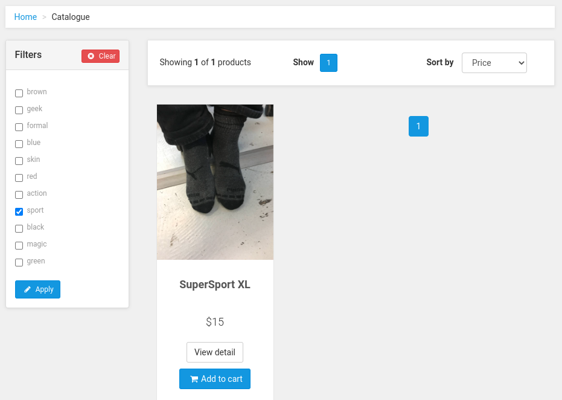
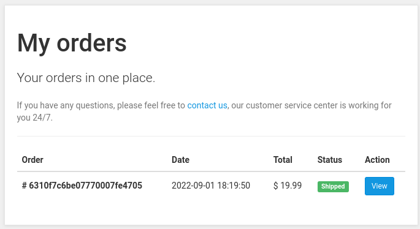

# Trabajo Práctico N°4

## Unidad 04: Arquitectura de Microservicios

### Ejercicio 1

```console
$ mkdir socks-demo
$ cd socks-demo
ivan:/socks-demo $ git clone https://github.com/microservices-demo/microservices-demo.git
Cloning into 'microservices-demo'...
remote: Enumerating objects: 10197, done.
remote: Total 10197 (delta 0), reused 0 (delta 0), pack-reused 10197
Receiving objects: 100% (10197/10197), 52.95 MiB | 586.00 KiB/s, done.
Resolving deltas: 100% (6207/6207), done.
ivan:/socks-demo $ cd microservices-demo
ivan:/socks-demo/microservices-demo $ docker-compose -f deploy/docker-compose/docker-compose.yml up -d
```







### Ejercicio 2

```console
ivan:/socks-demo/microservices-demo $ docker-compose -f deploy/docker-compose/docker-compose.yml ps
NAME                            COMMAND                  SERVICE             STATUS              PORTS
docker-compose-carts-1          "/usr/local/bin/java…"   carts               running
docker-compose-carts-db-1       "docker-entrypoint.s…"   carts-db            running             27017/tcp
docker-compose-catalogue-1      "/app -port=80"          catalogue           running             80/tcp
docker-compose-catalogue-db-1   "docker-entrypoint.s…"   catalogue-db        running             3306/tcp
docker-compose-edge-router-1    "traefik"                edge-router         running             0.0.0.0:80->80/tcp, :::80->80/tcp, 0.0.0.0:8080->8080/tcp, :::8080->8080/tcp
docker-compose-front-end-1      "/usr/local/bin/npm …"   front-end           running             8079/tcp
docker-compose-orders-1         "/usr/local/bin/java…"   orders              running
docker-compose-orders-db-1      "docker-entrypoint.s…"   orders-db           running             27017/tcp
docker-compose-payment-1        "/app -port=80"          payment             running             80/tcp
docker-compose-queue-master-1   "/usr/local/bin/java…"   queue-master        running
docker-compose-rabbitmq-1       "docker-entrypoint.s…"   rabbitmq            running             4369/tcp, 5671-5672/tcp, 25672/tcp
docker-compose-shipping-1       "/usr/local/bin/java…"   shipping            running
docker-compose-user-1           "/user -port=80"         user                running             80/tcp
docker-compose-user-db-1        "/entrypoint.sh mong…"   user-db             running             27017/tcp
docker-compose-user-sim-1       "/usr/local/bin/runL…"   user-sim            exited (0)
```

| Pros | Contras |
| ---- | ------- |
| Escalabilidad | Complejidad en la comunicación entre microservicios |
| Tolerante a fallos | Requiere más recursos |
| Separación de codebase | Testing mas difícil |
| Diversidad de tecnología | No práctico para sistemas pequeños |
| Despliegue independiente | Despliegue complejo |


- Contenedor de **API Gateway**:

```console
NAME                          COMMAND    SERVICE      STATUS   PORTS
docker-compose-edge-router-1  "traefik"  edge-router  running  0.0.0.0:80->80/tcp, :::80->80/tcp, 0.0.0.0:8080->8080/tcp, :::8080->8080/tcp
```

```console
$ curl http://localhost/customers
```

```json
{
  "_embedded":{
    "customer":[
      {
        "firstname":"eve",
        "lastname":"berger",
        "username":"eve_berger",
        "id":"57a98d98e4b00679b4a830af",
        "_links":{
          "addresses":{
            "href":"http://user/customers/57a98d98e4b00679b4a830af/addresses"
          },
          "cards":{
            "href":"http://user/customers/57a98d98e4b00679b4a830af/cards"
          },
          "customer":{
            "href":"http://user/customers/57a98d98e4b00679b4a830af"
          },
          "self":{
            "href":"http://user/customers/57a98d98e4b00679b4a830af"
          }
        }
      },
      {
        "firstname":"user",
        "lastname":"name",
        "username":"user",
        "id":"57a98d98e4b00679b4a830b2",
        "_links":{
          "addresses":{
            "href":"http://user/customers/57a98d98e4b00679b4a830b2/addresses"
          },
          "cards":{
            "href":"http://user/customers/57a98d98e4b00679b4a830b2/cards"
          },
          "customer":{
            "href":"http://user/customers/57a98d98e4b00679b4a830b2"
          },
          "self":{
            "href":"http://user/customers/57a98d98e4b00679b4a830b2"
          }
        }
      },
      {
        "firstname":"user1",
        "lastname":"name1",
        "username":"user1",
        "id":"57a98d98e4b00679b4a830b5",
        "_links":{
          "addresses":{
            "href":"http://user/customers/57a98d98e4b00679b4a830b5/addresses"
          },
          "cards":{
            "href":"http://user/customers/57a98d98e4b00679b4a830b5/cards"
          },
          "customer":{
            "href":"http://user/customers/57a98d98e4b00679b4a830b5"
          },
          "self":{
            "href":"http://user/customers/57a98d98e4b00679b4a830b5"
          }
        }
      },
      {
        "firstname":"ivan",
        "lastname":"nuñez",
        "username":"ivan",
        "id":"6310f6a1ee11cb00010ac39b",
        "_links":{
          "addresses":{
            "href":"http://user/customers/6310f6a1ee11cb00010ac39b/addresses"
          },
          "cards":{
            "href":"http://user/customers/6310f6a1ee11cb00010ac39b/cards"
          },
          "customer":{
            "href":"http://user/customers/6310f6a1ee11cb00010ac39b"
          },
          "self":{
            "href":"http://user/customers/6310f6a1ee11cb00010ac39b"
          }
        }
      }
    ]
  }
}
```

```golang
// user service
// MakeUserGetEndpoint returns an endpoint via the given service.
func MakeUserGetEndpoint(s Service) endpoint.Endpoint {
	return func(ctx context.Context, request interface{}) (response interface{}, err error) {
		var span stdopentracing.Span
		span, ctx = stdopentracing.StartSpanFromContext(ctx, "get users")
		span.SetTag("service", "user")
		defer span.Finish()

		req := request.(GetRequest)

		userspan := stdopentracing.StartSpan("users from db", stdopentracing.ChildOf(span.Context()))
		usrs, err := s.GetUsers(req.ID)
		userspan.Finish()
		if req.ID == "" {
			return EmbedStruct{usersResponse{Users: usrs}}, err
		}
		if len(usrs) == 0 {
			if req.Attr == "addresses" {
				return EmbedStruct{addressesResponse{Addresses: make([]users.Address, 0)}}, err
			}
			if req.Attr == "cards" {
				return EmbedStruct{cardsResponse{Cards: make([]users.Card, 0)}}, err
			}
			return users.User{}, err
		}
		user := usrs[0]
		attrspan := stdopentracing.StartSpan("attributes from db", stdopentracing.ChildOf(span.Context()))
		db.GetUserAttributes(&user)
		attrspan.Finish()
		if req.Attr == "addresses" {
			return EmbedStruct{addressesResponse{Addresses: user.Addresses}}, err
		}
		if req.Attr == "cards" {
			return EmbedStruct{cardsResponse{Cards: user.Cards}}, err
		}
		return user, err
	}
}
```

```golang
// catalogue service
// MakeListEndpoint returns an endpoint via the given service.
func MakeListEndpoint(s Service) endpoint.Endpoint {
  return func(ctx context.Context, request interface{}) (response interface{}, err error) {
    req := request.(listRequest)
    socks, err := s.List(req.Tags, req.Order, req.PageNum, req.PageSize)
    return listResponse{Socks: socks, Err: err}, err
  }
}

// MakeTagsEndpoint returns an endpoint via the given service.
func MakeTagsEndpoint(s Service) endpoint.Endpoint {
  return func(ctx context.Context, request interface{}) (response interface{}, err error) {
    tags, err := s.Tags()
    return tagsResponse{Tags: tags, Err: err}, err
  }
}
```

Existen 4 servicios destinados a la persistencia de datos:

- `catalogue-db`
- `carts-db`
- `orders-db`
- `user-db`

Servicio encargado del procesamiento de la cola `rabbitmq`:

- `queue-master`

Documentación sobre la [Arquitectura](https://github.com/microservices-demo/microservices-demo/blob/master/internal-docs/design.md)
y comunicación entre servicios.
