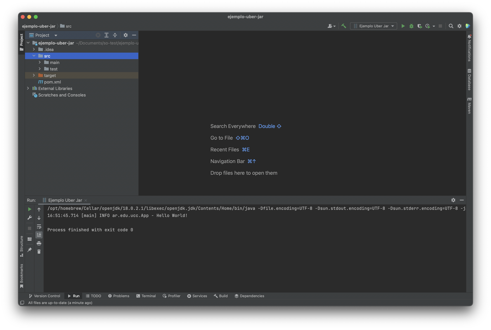

# Trabajo Práctico N°5

## Unidad 05: Herramientas de Construcción de Software

### Ejercicio 1

```console
$ java --version
openjdk 18.0.2 2022-07-19
OpenJDK Runtime Environment (build 18.0.2+9)
OpenJDK 64-Bit Server VM (build 18.0.2+9, mixed mode)
```

### Ejercicio 2

```console
$ mvn --version
Apache Maven 3.8.6 (84538c9988a25aec085021c365c560670ad80f63)
Maven home: /home/user/.devel/maven
Java version: 18.0.2, vendor: N/A, runtime: /usr/lib/jvm/java-18-openjdk
Default locale: en_US, platform encoding: UTF-8
OS name: "linux", version: "5.19.3-arch1-1", arch: "amd64", family: "unix"
```

### Ejercicio 3

- **Maven**: herramienta de software para la gestión y construcción de proyectos Java.

- Project Object Model **POM**: Maven utiliza un POM basado en el formato
XML para describir el proyecto de software a construir, dependencias de
otros módulos y componentes externos, y el orden de construcción de los
elementos. Viene con objetivos predefinidos para realizar ciertas tareas
claramente definidas, como la compilación del código y su empaquetado.

  - modelVersion - version del modelo a utilizar
  - groupId - id del grupo de proyecto
  - artifactId - id del artefacto (proyecto)
  - version - version del artefacto dentro del grupo especificado

- Repositorios: un repositorio en Maven contiene artefactos de compilación y
dependencias de diferentes tipos.

	- Local: es un directorio en la computadora donde se ejecuta Maven. Almacena
	en caché las descargas remotas y contiene artefactos de compilación
	temporales que aún no ha publicado.
	- Remoto: refieren a cualquier otro tipo de repositorio, al que se accede
	mediante una variedad de protocolos, como `file://` y `https://`.
		- Repositorio central maven: `repo.maven.apache.org`.
		- repositorios internos configurados en un servidor de archivos o HTTP
		dentro de su empresa, utilizados para compartir artefactos privados entre
		equipos de desarrollo y para lanzamientos.

- Ciclos de vida: Maven se basa en el concepto central de un ciclo de vida de
construcción, el proceso para construir y distribuir un artefacto en
particular está claramente definido. Para la persona que construye un proyecto,
esto significa que solo es necesario aprender un pequeño conjunto de comandos
para construir cualquier proyecto de Maven, y el POM se asegurará de que
obtenga los resultados que desea.

	- [Default](https://maven.apache.org/guides/introduction/introduction-to-the-lifecycle.html#default-lifecycle):
	maneja la implementacion y el despliegue del proyecto.
	- [Clean](https://maven.apache.org/guides/introduction/introduction-to-the-lifecycle.html#clean-lifecycle):
	maneja la limpieza del proyecto.
	- [Site](https://maven.apache.org/guides/introduction/introduction-to-the-lifecycle.html#site-lifecycle):
	maneja la creacion del sitio web del proyecto.

```console
$ mvn clean install
```


Maven corrio el proceso de ciclo de vida `clean` antes de ejecutar el proceso de
instalacion del proyecto. Lo que significa que elimina cualquier archivo
compilado previamente, asegurando una compilacion desde cero del artefacto. El
resultado final es un archivo ejecutable `.jar`.

### Ejercicio 4

```console
$ mvn archetype:generate -DgroupId=ar.edu.ucc -DartifactId=ejemplo -DarchetypeArtifactId=maven-archetype-quickstart -DinteractiveMode=false
$ cd ejemplo
$ mvn clean package
$ java -cp target/ejemplo-1.0.jar ar.edu.ucc.App
Hello World!
```


### Ejercicio 6

```console
$ mvn archetype:generate -DgroupId=ar.edu.ucc -DartifactId=ejemplo-uber-jar -DarchetypeArtifactId=maven-archetype-quickstart -DinteractiveMode=false
$ cd ejemplo-uber-jar
```


```console
$ mvn clean package
```

El error de compilacion sucede al no encontrar el paquete `org.slf4j`, se
deberia agregar la dependencia en el archivo `pom.xml`.

```console
$ mvn clean install
$ mvn clean package
```


<!-- No me funciono la compilacion con classpaths -->

Luego de instalar el plugin maven shade,

```console
$ mvn clean install
$ mvn clean package
$ java -jar target/ejemplo-uber-jar.jar
16:21:59.689 [main] INFO ar.edu.ucc.App - Hello World!
```

### Ejercicio 7


