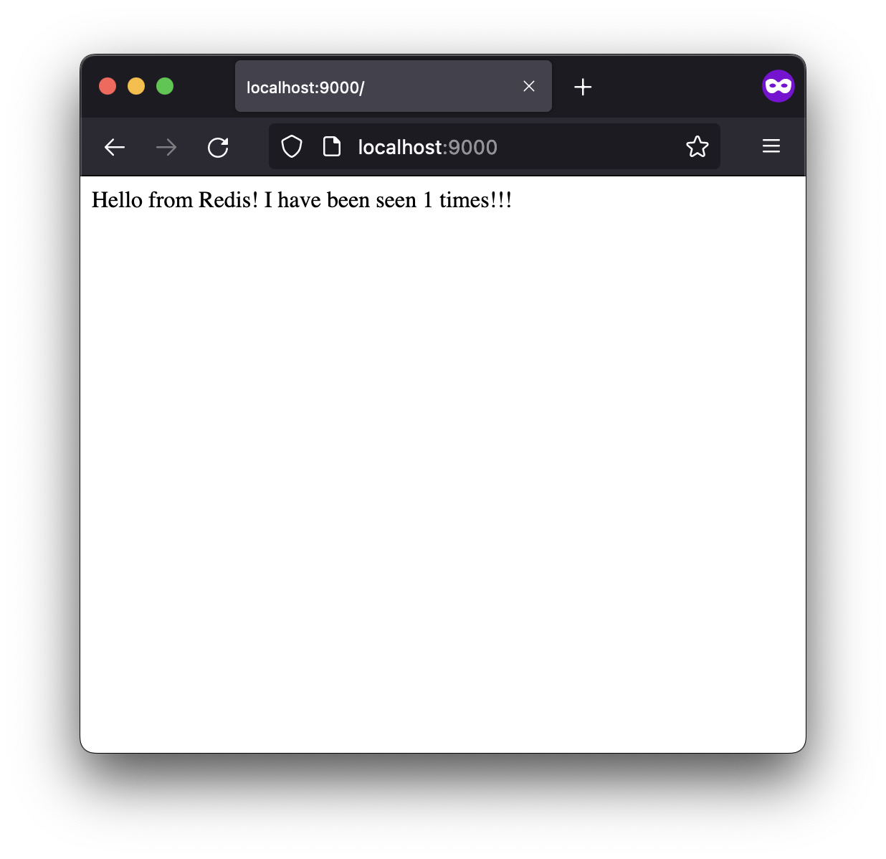
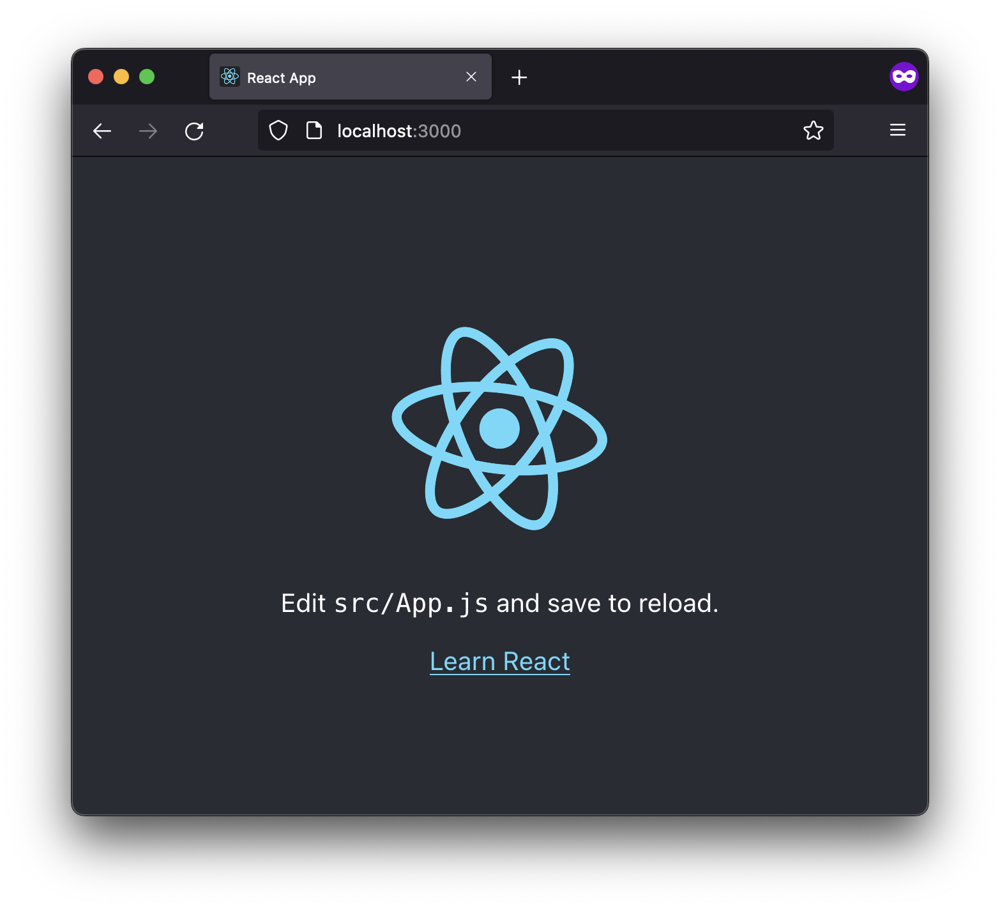

# Trabajo Práctico N°6

## Unidad 06: Construcción de Imágenes de Docker

### Ejercicio 1

- `FROM`: inicializa una nueva etapa de contruccion y establece la imagen base
para las instrucciones posteriores. Un `Dockerfile` debe arrancar con la
instruccion `FROM`. La imagen puede ser obtenida de los repositorios publicos
del docker hub.

```Dockerfile
FROM [--platform=<platform>] <image>[:<tag>] [AS <name>]
```

- `RUN`: ejecuta un comando creando una nueva capa encima de imagen actual y
hará commit de los resultados. La imagen resultante se usará para el siguiente
paso en el `Dockerfile`.

```Dockerfile
RUN <command>
RUN ["executable", "param1", "param2"]
```

- `ADD`: copia archivos, directorios o archivos obtenidos a partir de una url
de una fuente `<src>` y los agrega al sistema de archivos de la imagen en la
ruta `<dest>`.

```Dockerfile
ADD [--chown=<user>:<group>] <src>... <dest>
ADD [--chown=<user>:<group>] ["<src>",... "<dest>"]
```

- `COPY`: copia archivos o directorios de una fuente `<src>` y los agrega al
sistema de archivos de la imagen en la ruta `<dest>`.

```Dockerfile
COPY [--chown=<user>:<group>] <src>... <dest>
COPY [--chown=<user>:<group>] ["<src>",... "<dest>"]
```

- `EXPOSE`: informa a Docker que el contenedor escucha en los puertos de red
especificados en tiempo de ejecución. Puede especificar si el puerto escucha
en los protocolos `tcp` o `udp`. No se publica/expone el puerto, la instruccion
actua como documentación entre la persona que construye la imagen y la persona
que ejecuta el contenedor, sobre qué puertos se pretende publicar.

```Dockerfile
EXPOSE <port> [<port>/<protocol>...]
```

- `CMD`: su objetivo principal es proporcionar valores predeterminados para un
contenedor en ejecución. Estos valores predeterminados pueden incluir un
ejecutable o pueden omitir el ejecutable, en cuyo caso también debe especificar
una instrucción ENTRYPOINT.

```Dockerfile
CMD ["executable","param1","param2"]
CMD ["param1","param2"]
CMD command param1 param2
```

- `ENTRYPOINT`: permite configurar a un contenedor que se ejecutara como un
ejecutable.

```Dockerfile
ENTRYPOINT ["executable", "param1", "param2"]
ENTRYPOINT command param1 param2
```

### Ejercicio 2

```console
$ git clone https://github.com/fernandobono/ing-software-3
$ cd ing-software-3/proyectos/spring-boot
$ mvn clean package spring-boot:repackage
```

```Dockerfile
FROM openjdk:8-jre-alpine

RUN apk add --no-cache bash

WORKDIR /app

COPY target/*.jar ./spring-boot-application.jar

ENV JAVA_OPTS="-Xms32m -Xmx128m"
EXPOSE 8080

ENTRYPOINT exec java $JAVA_OPTS -Djava.security.egd=file:/dev/./urandom -jar spring-boot-application.jar
```

```console
$ docker build -t test-spring-boot .
$ docker run -p 8080:8080 test-spring-boot

  .   ____          _            __ _ _
 /\\ / ___'_ __ _ _(_)_ __  __ _ \ \ \ \
( ( )\___ | '_ | '_| | '_ \/ _` | \ \ \ \
 \\/  ___)| |_)| | | | | || (_| |  ) ) ) )
  '  |____| .__|_| |_|_| |_\__, | / / / /
 =========|_|==============|___/=/_/_/_/
 :: Spring Boot ::        (v2.0.2.RELEASE)

2022-09-19 03:00:36.092  INFO 1 --- [           main] s.actuator.SampleActuatorApplication     : Starting SampleActuatorApplication v2.0.2 on 123b462d77cf with PID 1 (/app/spring-boot-application.jar started by root in /app)
2022-09-19 03:00:36.095  INFO 1 --- [           main] s.actuator.SampleActuatorApplication     : No active profile set, falling back to default profiles: default
2022-09-19 03:00:36.125  INFO 1 --- [           main] ConfigServletWebServerApplicationContext : Refreshing org.springframework.boot.web.servlet.context.AnnotationConfigServletWebServerApplicationContext@27abe2cd: startup date [Mon Sep 19 03:00:36 GMT 2022]; root of context hierarchy
2022-09-19 03:00:36.898  INFO 1 --- [           main] trationDelegate$BeanPostProcessorChecker : Bean 'org.springframework.transaction.annotation.ProxyTransactionManagementConfiguration' of type [org.springframework.transaction.annotation.ProxyTransactionManagementConfiguration$$EnhancerBySpringCGLIB$$a1a65bcd] is not eligible for getting processed by all BeanPostProcessors (for example: not eligible for auto-proxying)
2022-09-19 03:00:37.120  INFO 1 --- [           main] o.s.b.w.embedded.tomcat.TomcatWebServer  : Tomcat initialized with port(s): 8080 (http)
2022-09-19 03:00:37.137  INFO 1 --- [           main] o.apache.catalina.core.StandardService   : Starting service [Tomcat]
2022-09-19 03:00:37.138  INFO 1 --- [           main] org.apache.catalina.core.StandardEngine  : Starting Servlet Engine: Apache Tomcat/8.5.31
2022-09-19 03:00:37.144  INFO 1 --- [ost-startStop-1] o.a.catalina.core.AprLifecycleListener   : The APR based Apache Tomcat Native library which allows optimal performance in production environments was not found on the java.library.path: [/usr/lib/jvm/java-1.8-openjdk/jre/lib/aarch64/server:/usr/lib/jvm/java-1.8-openjdk/jre/lib/aarch64:/usr/lib/jvm/java-1.8-openjdk/jre/../lib/aarch64:/usr/java/packages/lib/aarch64:/lib:/usr/lib]
2022-09-19 03:00:37.193  INFO 1 --- [ost-startStop-1] o.a.c.c.C.[Tomcat].[localhost].[/]       : Initializing Spring embedded WebApplicationContext
2022-09-19 03:00:37.193  INFO 1 --- [ost-startStop-1] o.s.web.context.ContextLoader            : Root WebApplicationContext: initialization completed in 1068 ms
2022-09-19 03:00:37.638  INFO 1 --- [ost-startStop-1] o.s.b.w.servlet.ServletRegistrationBean  : Servlet dispatcherServlet mapped to [/]
2022-09-19 03:00:37.640  INFO 1 --- [ost-startStop-1] o.s.b.w.servlet.FilterRegistrationBean   : Mapping filter: 'characterEncodingFilter' to: [/*]
2022-09-19 03:00:37.640  INFO 1 --- [ost-startStop-1] o.s.b.w.servlet.FilterRegistrationBean   : Mapping filter: 'hiddenHttpMethodFilter' to: [/*]
2022-09-19 03:00:37.640  INFO 1 --- [ost-startStop-1] o.s.b.w.servlet.FilterRegistrationBean   : Mapping filter: 'httpPutFormContentFilter' to: [/*]
2022-09-19 03:00:37.641  INFO 1 --- [ost-startStop-1] o.s.b.w.servlet.FilterRegistrationBean   : Mapping filter: 'requestContextFilter' to: [/*]
2022-09-19 03:00:37.641  INFO 1 --- [ost-startStop-1] o.s.b.w.servlet.FilterRegistrationBean   : Mapping filter: 'httpTraceFilter' to: [/*]
2022-09-19 03:00:37.641  INFO 1 --- [ost-startStop-1] o.s.b.w.servlet.FilterRegistrationBean   : Mapping filter: 'webMvcMetricsFilter' to: [/*]
2022-09-19 03:00:37.718  INFO 1 --- [           main] o.s.w.s.handler.SimpleUrlHandlerMapping  : Mapped URL path [/**/favicon.ico] onto handler of type [class org.springframework.web.servlet.resource.ResourceHttpRequestHandler]
2022-09-19 03:00:37.842  INFO 1 --- [           main] s.w.s.m.m.a.RequestMappingHandlerAdapter : Looking for @ControllerAdvice: org.springframework.boot.web.servlet.context.AnnotationConfigServletWebServerApplicationContext@27abe2cd: startup date [Mon Sep 19 03:00:36 GMT 2022]; root of context hierarchy
2022-09-19 03:00:37.888  INFO 1 --- [           main] s.w.s.m.m.a.RequestMappingHandlerMapping : Mapped "{[/],methods=[POST],produces=[application/json]}" onto public java.util.Map<java.lang.String, java.lang.Object> sample.actuator.SampleController.olleh(sample.actuator.SampleController$Message)
2022-09-19 03:00:37.888  INFO 1 --- [           main] s.w.s.m.m.a.RequestMappingHandlerMapping : Mapped "{[/foo]}" onto public java.lang.String sample.actuator.SampleController.foo()
2022-09-19 03:00:37.889  INFO 1 --- [           main] s.w.s.m.m.a.RequestMappingHandlerMapping : Mapped "{[/],methods=[GET],produces=[application/json]}" onto public java.util.Map<java.lang.String, java.lang.String> sample.actuator.SampleController.hello()
2022-09-19 03:00:37.890  INFO 1 --- [           main] s.w.s.m.m.a.RequestMappingHandlerMapping : Mapped "{[/error],produces=[text/html]}" onto public org.springframework.web.servlet.ModelAndView org.springframework.boot.autoconfigure.web.servlet.error.BasicErrorController.errorHtml(javax.servlet.http.HttpServletRequest,javax.servlet.http.HttpServletResponse)
2022-09-19 03:00:37.891  INFO 1 --- [           main] s.w.s.m.m.a.RequestMappingHandlerMapping : Mapped "{[/error]}" onto public org.springframework.http.ResponseEntity<java.util.Map<java.lang.String, java.lang.Object>> org.springframework.boot.autoconfigure.web.servlet.error.BasicErrorController.error(javax.servlet.http.HttpServletRequest)
2022-09-19 03:00:37.913  INFO 1 --- [           main] o.s.w.s.handler.SimpleUrlHandlerMapping  : Mapped URL path [/webjars/**] onto handler of type [class org.springframework.web.servlet.resource.ResourceHttpRequestHandler]
2022-09-19 03:00:37.913  INFO 1 --- [           main] o.s.w.s.handler.SimpleUrlHandlerMapping  : Mapped URL path [/**] onto handler of type [class org.springframework.web.servlet.resource.ResourceHttpRequestHandler]
2022-09-19 03:00:38.122  INFO 1 --- [           main] o.s.b.a.e.web.EndpointLinksResolver      : Exposing 15 endpoint(s) beneath base path '/actuator'
2022-09-19 03:00:38.128  INFO 1 --- [           main] s.b.a.e.w.s.WebMvcEndpointHandlerMapping : Mapped "{[/actuator/auditevents],methods=[GET],produces=[application/vnd.spring-boot.actuator.v2+json || application/json]}" onto public java.lang.Object org.springframework.boot.actuate.endpoint.web.servlet.AbstractWebMvcEndpointHandlerMapping$OperationHandler.handle(javax.servlet.http.HttpServletRequest,java.util.Map<java.lang.String, java.lang.String>)
2022-09-19 03:00:38.128  INFO 1 --- [           main] s.b.a.e.w.s.WebMvcEndpointHandlerMapping : Mapped "{[/actuator/beans],methods=[GET],produces=[application/vnd.spring-boot.actuator.v2+json || application/json]}" onto public java.lang.Object org.springframework.boot.actuate.endpoint.web.servlet.AbstractWebMvcEndpointHandlerMapping$OperationHandler.handle(javax.servlet.http.HttpServletRequest,java.util.Map<java.lang.String, java.lang.String>)
2022-09-19 03:00:38.129  INFO 1 --- [           main] s.b.a.e.w.s.WebMvcEndpointHandlerMapping : Mapped "{[/actuator/health],methods=[GET],produces=[application/vnd.spring-boot.actuator.v2+json || application/json]}" onto public java.lang.Object org.springframework.boot.actuate.endpoint.web.servlet.AbstractWebMvcEndpointHandlerMapping$OperationHandler.handle(javax.servlet.http.HttpServletRequest,java.util.Map<java.lang.String, java.lang.String>)
2022-09-19 03:00:38.129  INFO 1 --- [           main] s.b.a.e.w.s.WebMvcEndpointHandlerMapping : Mapped "{[/actuator/conditions],methods=[GET],produces=[application/vnd.spring-boot.actuator.v2+json || application/json]}" onto public java.lang.Object org.springframework.boot.actuate.endpoint.web.servlet.AbstractWebMvcEndpointHandlerMapping$OperationHandler.handle(javax.servlet.http.HttpServletRequest,java.util.Map<java.lang.String, java.lang.String>)
2022-09-19 03:00:38.129  INFO 1 --- [           main] s.b.a.e.w.s.WebMvcEndpointHandlerMapping : Mapped "{[/actuator/shutdown],methods=[POST],produces=[application/vnd.spring-boot.actuator.v2+json || application/json]}" onto public java.lang.Object org.springframework.boot.actuate.endpoint.web.servlet.AbstractWebMvcEndpointHandlerMapping$OperationHandler.handle(javax.servlet.http.HttpServletRequest,java.util.Map<java.lang.String, java.lang.String>)
2022-09-19 03:00:38.130  INFO 1 --- [           main] s.b.a.e.w.s.WebMvcEndpointHandlerMapping : Mapped "{[/actuator/configprops],methods=[GET],produces=[application/vnd.spring-boot.actuator.v2+json || application/json]}" onto public java.lang.Object org.springframework.boot.actuate.endpoint.web.servlet.AbstractWebMvcEndpointHandlerMapping$OperationHandler.handle(javax.servlet.http.HttpServletRequest,java.util.Map<java.lang.String, java.lang.String>)
2022-09-19 03:00:38.130  INFO 1 --- [           main] s.b.a.e.w.s.WebMvcEndpointHandlerMapping : Mapped "{[/actuator/env/{toMatch}],methods=[GET],produces=[application/vnd.spring-boot.actuator.v2+json || application/json]}" onto public java.lang.Object org.springframework.boot.actuate.endpoint.web.servlet.AbstractWebMvcEndpointHandlerMapping$OperationHandler.handle(javax.servlet.http.HttpServletRequest,java.util.Map<java.lang.String, java.lang.String>)
2022-09-19 03:00:38.130  INFO 1 --- [           main] s.b.a.e.w.s.WebMvcEndpointHandlerMapping : Mapped "{[/actuator/env],methods=[GET],produces=[application/vnd.spring-boot.actuator.v2+json || application/json]}" onto public java.lang.Object org.springframework.boot.actuate.endpoint.web.servlet.AbstractWebMvcEndpointHandlerMapping$OperationHandler.handle(javax.servlet.http.HttpServletRequest,java.util.Map<java.lang.String, java.lang.String>)
2022-09-19 03:00:38.130  INFO 1 --- [           main] s.b.a.e.w.s.WebMvcEndpointHandlerMapping : Mapped "{[/actuator/info],methods=[GET],produces=[application/vnd.spring-boot.actuator.v2+json || application/json]}" onto public java.lang.Object org.springframework.boot.actuate.endpoint.web.servlet.AbstractWebMvcEndpointHandlerMapping$OperationHandler.handle(javax.servlet.http.HttpServletRequest,java.util.Map<java.lang.String, java.lang.String>)
2022-09-19 03:00:38.130  INFO 1 --- [           main] s.b.a.e.w.s.WebMvcEndpointHandlerMapping : Mapped "{[/actuator/loggers],methods=[GET],produces=[application/vnd.spring-boot.actuator.v2+json || application/json]}" onto public java.lang.Object org.springframework.boot.actuate.endpoint.web.servlet.AbstractWebMvcEndpointHandlerMapping$OperationHandler.handle(javax.servlet.http.HttpServletRequest,java.util.Map<java.lang.String, java.lang.String>)
2022-09-19 03:00:38.131  INFO 1 --- [           main] s.b.a.e.w.s.WebMvcEndpointHandlerMapping : Mapped "{[/actuator/loggers/{name}],methods=[GET],produces=[application/vnd.spring-boot.actuator.v2+json || application/json]}" onto public java.lang.Object org.springframework.boot.actuate.endpoint.web.servlet.AbstractWebMvcEndpointHandlerMapping$OperationHandler.handle(javax.servlet.http.HttpServletRequest,java.util.Map<java.lang.String, java.lang.String>)
2022-09-19 03:00:38.131  INFO 1 --- [           main] s.b.a.e.w.s.WebMvcEndpointHandlerMapping : Mapped "{[/actuator/loggers/{name}],methods=[POST],consumes=[application/vnd.spring-boot.actuator.v2+json || application/json]}" onto public java.lang.Object org.springframework.boot.actuate.endpoint.web.servlet.AbstractWebMvcEndpointHandlerMapping$OperationHandler.handle(javax.servlet.http.HttpServletRequest,java.util.Map<java.lang.String, java.lang.String>)
2022-09-19 03:00:38.131  INFO 1 --- [           main] s.b.a.e.w.s.WebMvcEndpointHandlerMapping : Mapped "{[/actuator/heapdump],methods=[GET],produces=[application/octet-stream]}" onto public java.lang.Object org.springframework.boot.actuate.endpoint.web.servlet.AbstractWebMvcEndpointHandlerMapping$OperationHandler.handle(javax.servlet.http.HttpServletRequest,java.util.Map<java.lang.String, java.lang.String>)
2022-09-19 03:00:38.132  INFO 1 --- [           main] s.b.a.e.w.s.WebMvcEndpointHandlerMapping : Mapped "{[/actuator/threaddump],methods=[GET],produces=[application/vnd.spring-boot.actuator.v2+json || application/json]}" onto public java.lang.Object org.springframework.boot.actuate.endpoint.web.servlet.AbstractWebMvcEndpointHandlerMapping$OperationHandler.handle(javax.servlet.http.HttpServletRequest,java.util.Map<java.lang.String, java.lang.String>)
2022-09-19 03:00:38.132  INFO 1 --- [           main] s.b.a.e.w.s.WebMvcEndpointHandlerMapping : Mapped "{[/actuator/metrics/{requiredMetricName}],methods=[GET],produces=[application/vnd.spring-boot.actuator.v2+json || application/json]}" onto public java.lang.Object org.springframework.boot.actuate.endpoint.web.servlet.AbstractWebMvcEndpointHandlerMapping$OperationHandler.handle(javax.servlet.http.HttpServletRequest,java.util.Map<java.lang.String, java.lang.String>)
2022-09-19 03:00:38.132  INFO 1 --- [           main] s.b.a.e.w.s.WebMvcEndpointHandlerMapping : Mapped "{[/actuator/metrics],methods=[GET],produces=[application/vnd.spring-boot.actuator.v2+json || application/json]}" onto public java.lang.Object org.springframework.boot.actuate.endpoint.web.servlet.AbstractWebMvcEndpointHandlerMapping$OperationHandler.handle(javax.servlet.http.HttpServletRequest,java.util.Map<java.lang.String, java.lang.String>)
2022-09-19 03:00:38.132  INFO 1 --- [           main] s.b.a.e.w.s.WebMvcEndpointHandlerMapping : Mapped "{[/actuator/scheduledtasks],methods=[GET],produces=[application/vnd.spring-boot.actuator.v2+json || application/json]}" onto public java.lang.Object org.springframework.boot.actuate.endpoint.web.servlet.AbstractWebMvcEndpointHandlerMapping$OperationHandler.handle(javax.servlet.http.HttpServletRequest,java.util.Map<java.lang.String, java.lang.String>)
2022-09-19 03:00:38.133  INFO 1 --- [           main] s.b.a.e.w.s.WebMvcEndpointHandlerMapping : Mapped "{[/actuator/httptrace],methods=[GET],produces=[application/vnd.spring-boot.actuator.v2+json || application/json]}" onto public java.lang.Object org.springframework.boot.actuate.endpoint.web.servlet.AbstractWebMvcEndpointHandlerMapping$OperationHandler.handle(javax.servlet.http.HttpServletRequest,java.util.Map<java.lang.String, java.lang.String>)
2022-09-19 03:00:38.133  INFO 1 --- [           main] s.b.a.e.w.s.WebMvcEndpointHandlerMapping : Mapped "{[/actuator/mappings],methods=[GET],produces=[application/vnd.spring-boot.actuator.v2+json || application/json]}" onto public java.lang.Object org.springframework.boot.actuate.endpoint.web.servlet.AbstractWebMvcEndpointHandlerMapping$OperationHandler.handle(javax.servlet.http.HttpServletRequest,java.util.Map<java.lang.String, java.lang.String>)
2022-09-19 03:00:38.133  INFO 1 --- [           main] s.b.a.e.w.s.WebMvcEndpointHandlerMapping : Mapped "{[/actuator],methods=[GET],produces=[application/vnd.spring-boot.actuator.v2+json || application/json]}" onto protected java.util.Map<java.lang.String, java.util.Map<java.lang.String, org.springframework.boot.actuate.endpoint.web.Link>> org.springframework.boot.actuate.endpoint.web.servlet.WebMvcEndpointHandlerMapping.links(javax.servlet.http.HttpServletRequest,javax.servlet.http.HttpServletResponse)
2022-09-19 03:00:38.171  INFO 1 --- [           main] o.s.j.e.a.AnnotationMBeanExporter        : Registering beans for JMX exposure on startup
2022-09-19 03:00:38.172  INFO 1 --- [           main] o.s.j.e.a.AnnotationMBeanExporter        : Bean with name 'dataSource' has been autodetected for JMX exposure
2022-09-19 03:00:38.176  INFO 1 --- [           main] o.s.j.e.a.AnnotationMBeanExporter        : Located MBean 'dataSource': registering with JMX server as MBean [com.zaxxer.hikari:name=dataSource,type=HikariDataSource]
2022-09-19 03:00:38.202  INFO 1 --- [           main] o.s.b.w.embedded.tomcat.TomcatWebServer  : Tomcat started on port(s): 8080 (http) with context path ''
2022-09-19 03:00:38.205  INFO 1 --- [           main] s.actuator.SampleActuatorApplication     : Started SampleActuatorApplication in 2.306 seconds (JVM running for 2.657)
```

```console
$ curl -v localhost:8080
*   Trying 127.0.0.1:8080...
* Connected to localhost (127.0.0.1) port 8080 (#0)
> GET / HTTP/1.1
> Host: localhost:8080
> User-Agent: curl/7.79.1
> Accept: */*
> 
* Mark bundle as not supporting multiuse
< HTTP/1.1 200 
< Content-Type: application/json;charset=UTF-8
< Transfer-Encoding: chunked
< Date: Mon, 19 Sep 2022 03:02:20 GMT
< 
* Connection #0 to host localhost left intact
{"message":"Spring boot says hello from a Docker container"}%
```

### Ejercicio 3

```Dockerfile
FROM maven:3.5.2-jdk-8-alpine AS MAVEN_TOOL_CHAIN
COPY pom.xml /tmp/
RUN mvn -B dependency:go-offline -f /tmp/pom.xml -s /usr/share/maven/ref/settings-docker.xml
COPY src /tmp/src/
WORKDIR /tmp/
RUN mvn -B -s /usr/share/maven/ref/settings-docker.xml package

FROM openjdk:8-jre-alpine
EXPOSE 8080
RUN mkdir /app
COPY --from=MAVEN_TOOL_CHAIN /tmp/target/*.jar /app/spring-boot-application.jar
ENV JAVA_OPTS="-Xms32m -Xmx128m"
ENTRYPOINT exec java $JAVA_OPTS -Djava.security.egd=file:/dev/./urandom -jar /app/spring-boot-application.jar
HEALTHCHECK --interval=1m --timeout=3s CMD wget -q -T 3 -s http://localhost:8080/actuator/health/ || exit 1
```

```console
$ docker build -t test-spring-boot .
$ docker images
REPOSITORY         TAG       IMAGE ID       CREATED          SIZE
test-spring-boot   latest    3f73eef6a339   6 minutes ago    109MB
```

- `WORKDIR`: establece el directorio de trabajo para cualquier instrucción
`RUN`, `CMD`, `ENTRYPOINT`, `COPY` y `ADD` que le sigua en el `Dockerfile`. Si
el `WORKDIR` no existe, se creará incluso si no se usa en ninguna instrucción
posterior.

```Dockerfile
WORKDIR /path/to/workdir
```

- `ENV`: establece la variable de entorno `<key>` en el valor `<value>`. Este
valor estará en el entorno para todas las instrucciones posteriores en la etapa
de construcción.

```Dockerfile
ENV <key>=<value> ...
```

- `HEALTHCHECK`: le dice a Docker cómo probar un contenedor para comprobar que
sigue funcionando. Esto puede detectar casos como un servidor web que está
atascado en un bucle infinito y no puede manejar nuevas conexiones, aunque el
proceso del servidor todavía se está ejecutando.

```Dockerfile
HEALTHCHECK [OPTIONS] CMD command
HEALTHCHECK NONE
```

En la primera etapa el `Dockerfile` parte de una imagen que contiene maven y
un openjdk. En ella se realiza todo el proceso de instalacion de dependencias
y compilacion del proyecto.

Todo esto para que en la segunda etapa se parta de una imagen limpia de openjdk
y se copie el `.jar` de la primera etapa para que el proyecto se pueda correr.
Java al ser un lenguaje compilado, todas las dependencias requeridas en la
etapa de compilacion no son realmente necesarias una vez que ya se tiene el
ejecutable. Por consiguiente, en esta etapa nos ahorramos la parte de
instalacion de dependencias.

### Ejercicio 4

```console
$ cd ing-software-3/proyectos/python-flask
$ docker compose up -d
```



- `build.context`: especifica sea una ruta a un directorio que contenga un
`Dockerfile` o una URL de un repositorio de `git`. Compose lo compila y lo
etiqueta con un nombre generado, y usa esa imagen a partir de entonces.

### Ejercicio 5

```console
$ npx create-react-app nodejs-docker
$ cd nodejs-docker
```

```Dockerfile
FROM node:18.9.0-alpine AS build
WORKDIR /app
COPY package.json package-lock.json /app 
RUN npm install
COPY ./src /app/src
COPY ./public /app/public
RUN npm run build

FROM nginx:1.23.1-alpine AS run
COPY --from=build /app/build /usr/share/nginx/html
EXPOSE 80
```

```yml
services:
  app:
    image: test-node
    container_name: nodejs_app
    build:
      context: ./
    ports:
      - "3000:80"
```

```console
$ docker compose build
$ docker compose up -d
```


