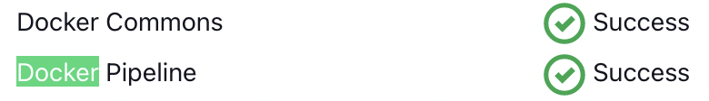
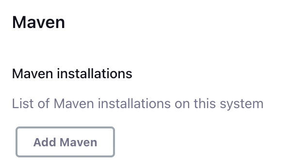
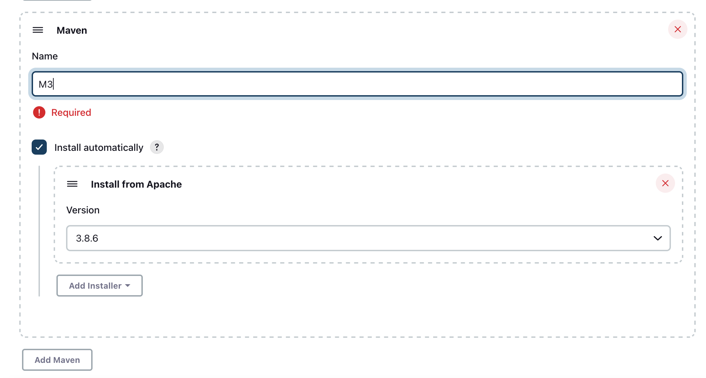

# Trabajo Práctico N°7

## Unidad 07: Servidor de Build (de integración continua)

### Ejercicio 1

```console
$ jenkins-lts --version
2.361.1
```


### Ejercicio 3

- [Docker Pipeline](https://plugins.jenkins.io/docker-workflow/) Plugin







