# Trabajo Práctico N°7

## Unidad 07: Servidor de Build (de integración continua)

### Ejercicio 1

```console
$ jenkins-lts --version
2.361.1
```


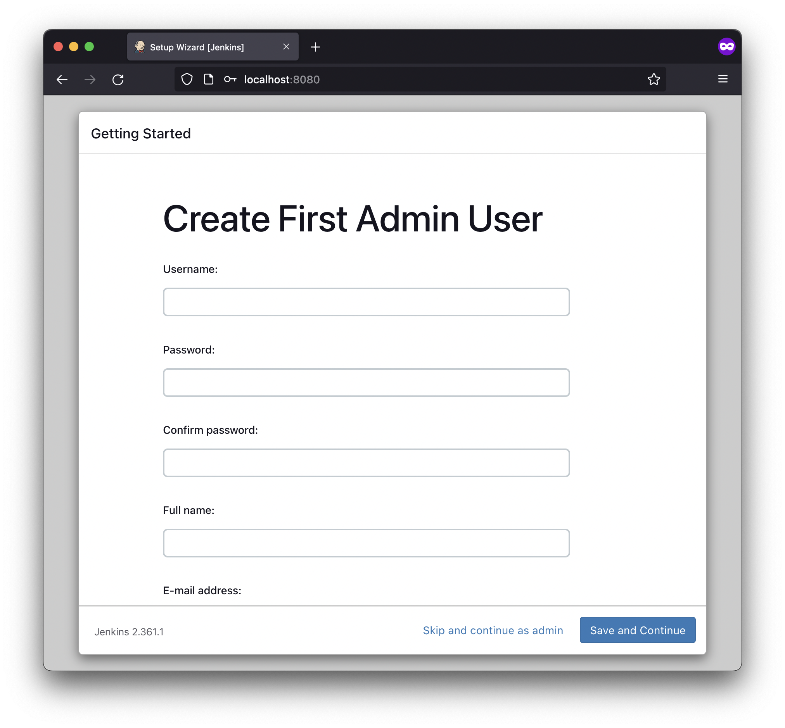

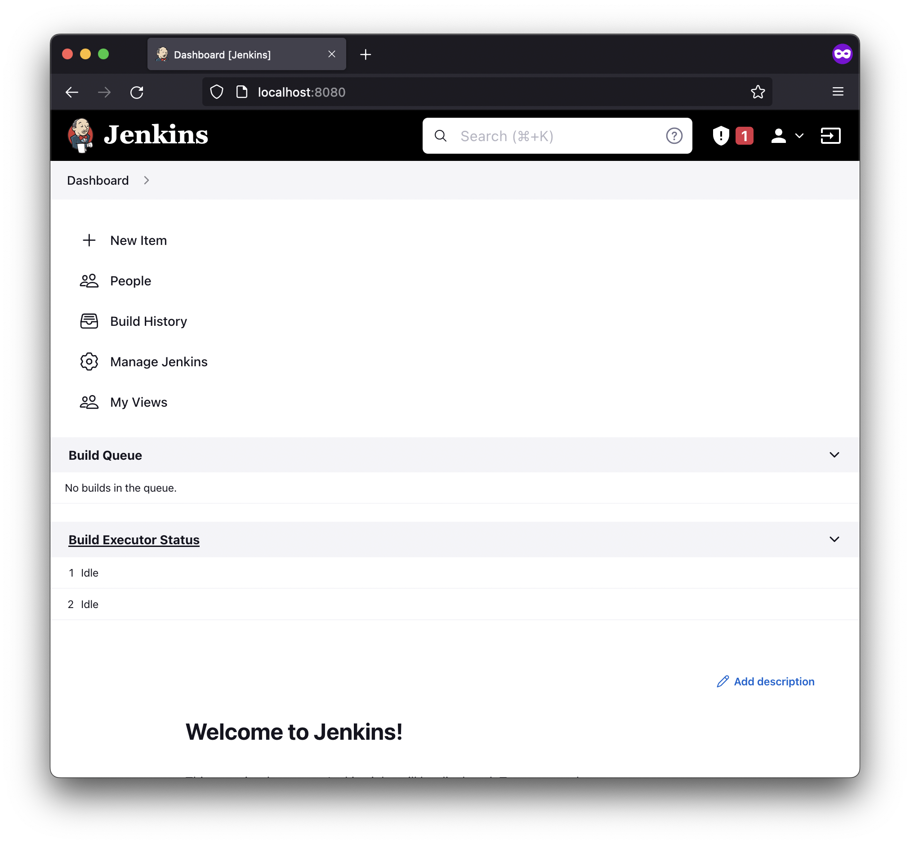

### Ejercicio 3

- [Docker Pipeline](https://plugins.jenkins.io/docker-workflow/) Plugin

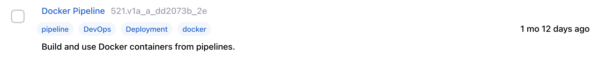

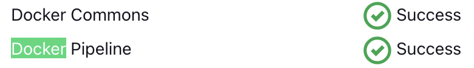


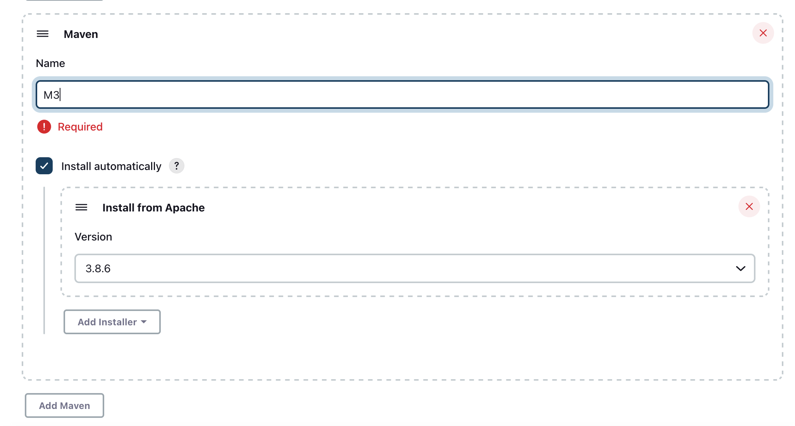

### Ejercicio 4

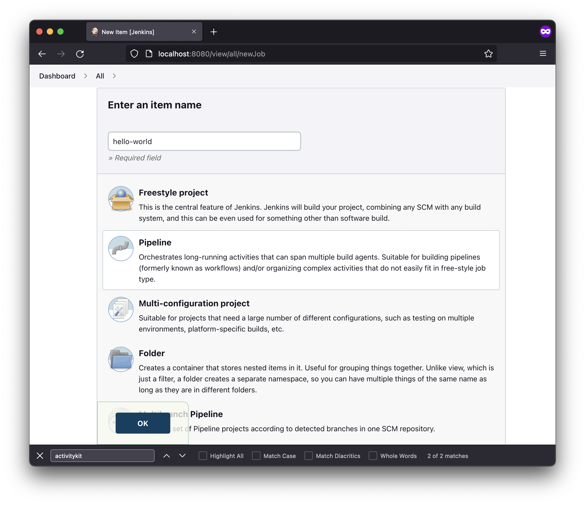

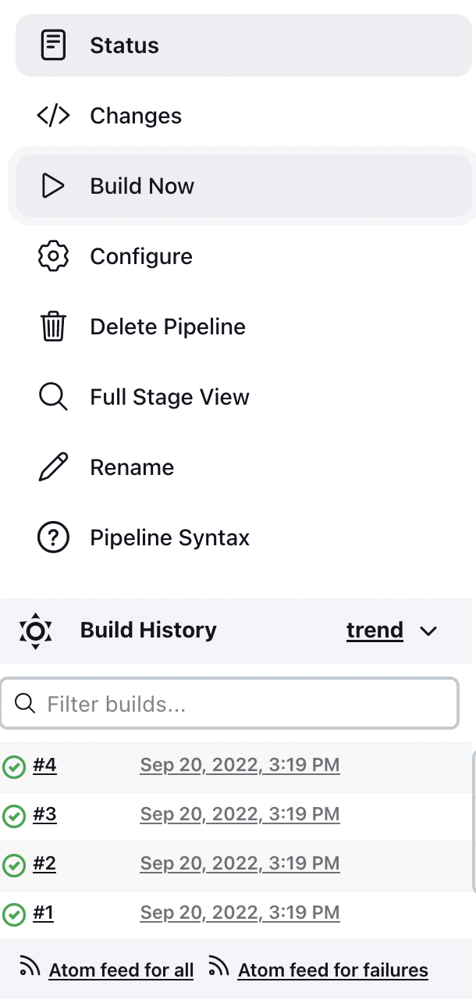

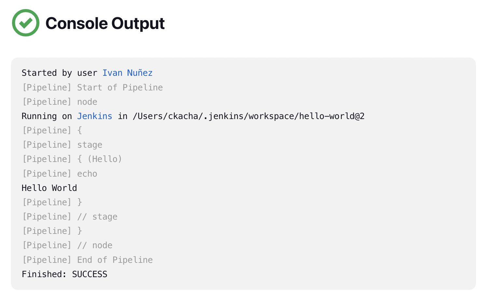

### Ejercicio 5

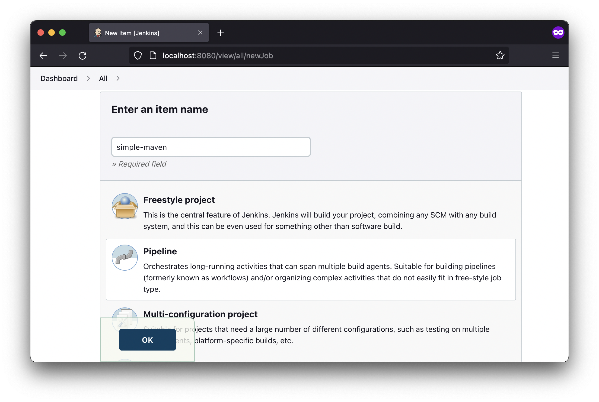

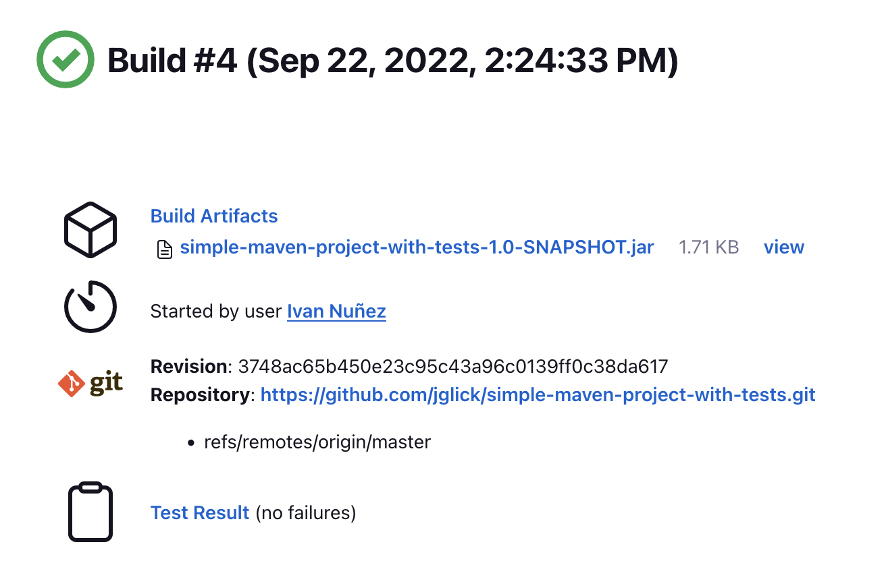

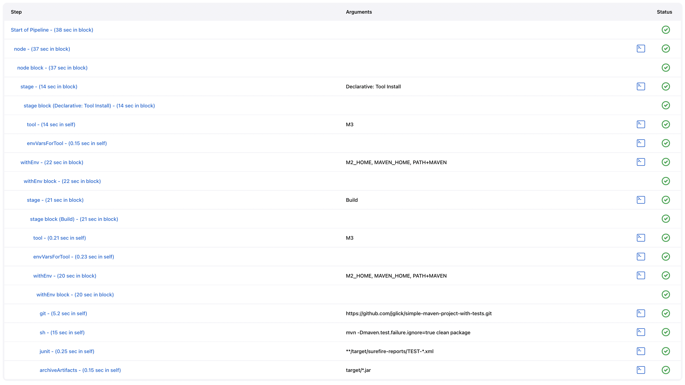

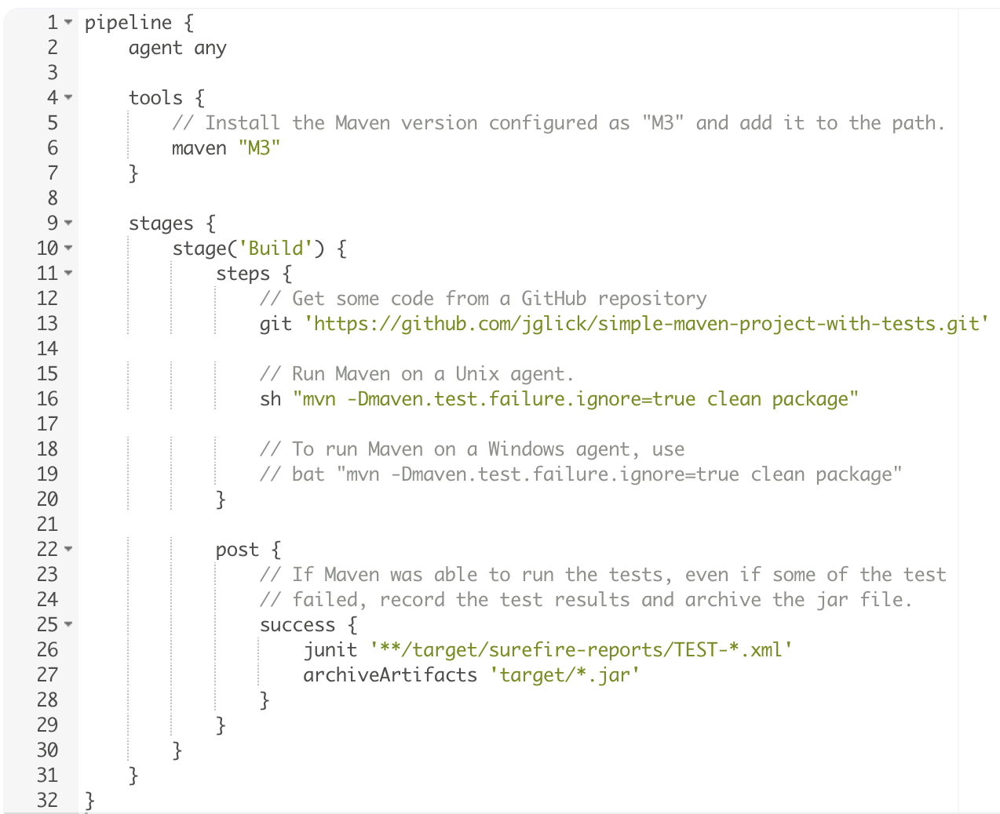

1. pipeline: define un "bloque" que contiene todos los contenidos e
instrucciones para ejecutar el Pipeline.
2. agent: indica a Jenkins que asigne un ejecutor (en un nodo) y un espacio de
trabajo para todo el Pipeline.
3. stage: bloque que describe una etapa del Pipeline.
4. steps: describe los pasos a correr en la etapa.
5. git: realiza una clonacion del repositorio especificado.
6. sh: es un paso del Pipeline que ejecuta un comando shell dado.

### Ejercicio 6

- Repositorio: [spring-boot](https://github.com/ivanln26/spring-boot)
- Pipeline Steps: [reference](https://www.jenkins.io/doc/pipeline/steps/)

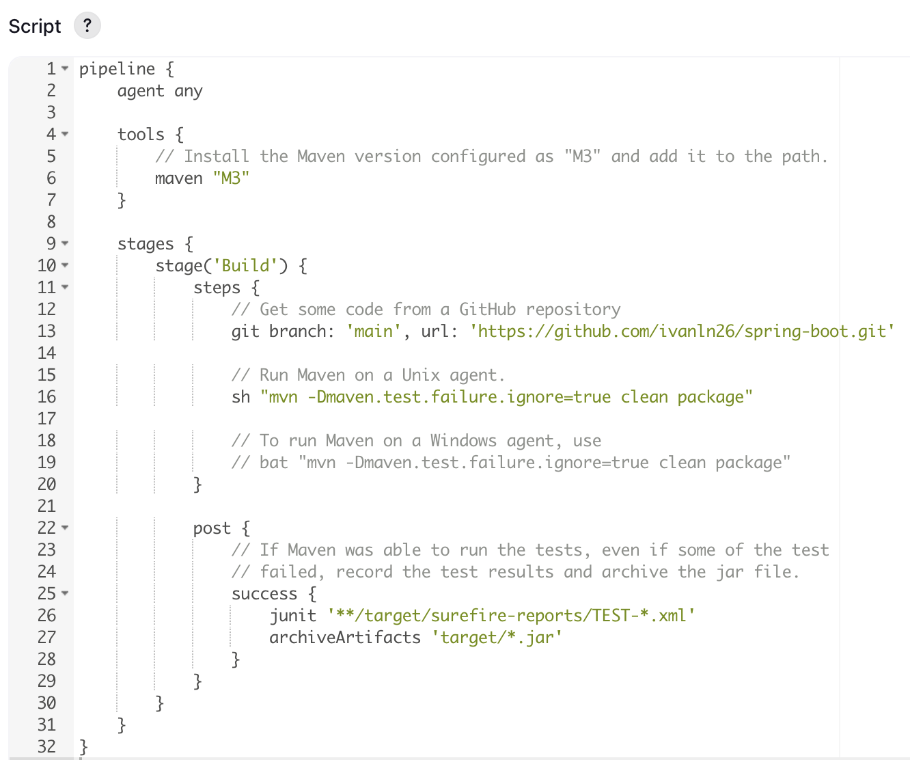

### Ejercicio 7

```groovy
def app

pipeline {
    agent any

    tools {
        maven 'M3'
    }

    stages {
        stage('Clone repository') {
            steps {
                git branch: 'main', url: 'https://github.com/ivanln26/spring-boot.git'
            }
        }
        
        stage('Build') {
            steps {
                sh 'mvn -Dmaven.test.failure.ignore=true clean package'
            }
            
            post {
                success {
                    junit '**/target/surefire-reports/TEST-*.xml'
                    archiveArtifacts 'target/*.jar'
                }
            }
        }

        stage('Build Docker Image') {
            steps {
                script {
                    app = docker.build('ivanln26/spring-boot:latest')
                }
            }
        }
        
        stage('Publish Docker Image') {
            steps {
                script {
                    docker.withRegistry('https://registry.hub.docker.com', 'docker-hub-credentials') {
                        app.push("${env.BUILD_NUMBER}")
                        app.push("latest")
                    }
                }
            }
        }
    }
}
```

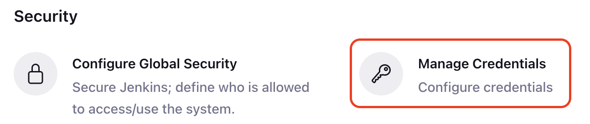

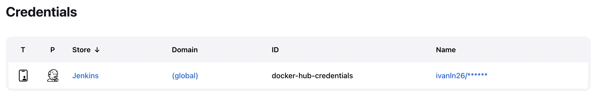

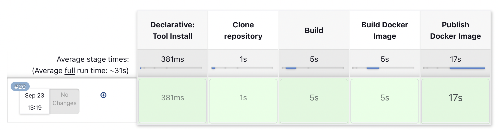

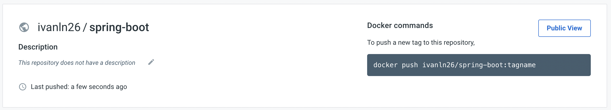

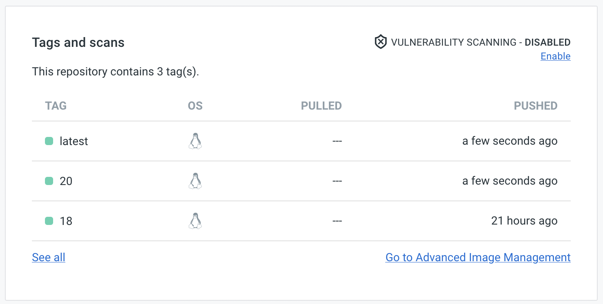

- Repositorio [Docker Hub](https://hub.docker.com/repository/docker/ivanln26/spring-boot)
