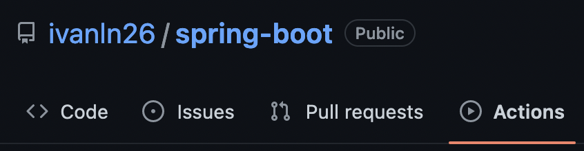
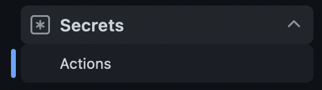
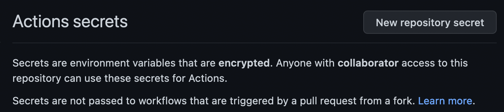
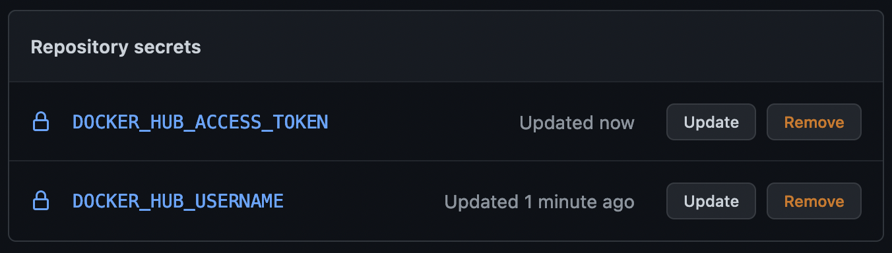
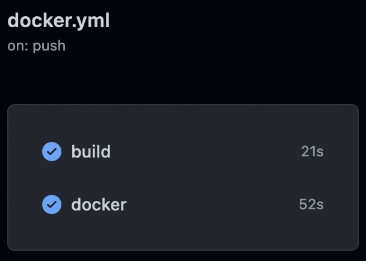
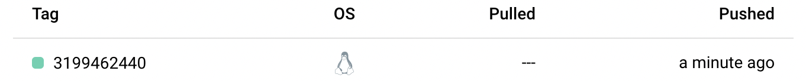

# Trabajo Práctico N°8

## Unidad 08: Herramientas de Construcción de Software en la Nube

### Ejercicio 1

Pros:

- Infraestructura inmediata: las soluciones cloud SaaS de las herramientas
CI/CD funcionan como un plug and play, con una mínima configuración ya se
puede tener un servidor de construcción de manera rápida. Se ahorra todo el
tiempo y preocupación de crear una nueva infraestructura para poder hostear
la herramienta, además del ahorro de mantenimiento y administración del
servidor.

- Disponibilidad: se puede acceder en cualquier momento que se necesite al
servicio desde cualquier lugar del mundo. Esta simpleza beneficia a
cualquier equipo distribuído por el mundo.

- Costos: resultan ser predecibles en el tiempo sobre las soluciones
propias de infraestructura, y no presentan un costo tan grande para poner en
marcha al servicio y empezar a realizar pruebas. El propio equipo de infra
de la solución se encarga de manejar las expensas del despliegue.

Contras:

- Pérdida sobre infra: todo el control de la infraestructura de este
servicio pasa a estar en manos de una empresa tercerizada. Si esta
organización sufre un ataque (ej: ddos) no podemos ser de mucha
ayuda para resolver el problema o monitorear el ataque, por lo que el
servicio quedaría inútil y todos nuestros procesos ci/cd se estancarían.

- Confiabilidad incerta: no sabemos de que manera ellos guardan nuestros
datos de los procesos y contraseñas en sus bases de datos.

### Ejercicio 2




```yml
name: Java CI with Maven

on:
  push:
    branches: [ "main" ]
  pull_request:
    branches: [ "main" ]

jobs:
  build:

    runs-on: ubuntu-latest

    steps:
    - uses: actions/checkout@v3
    - name: Set up JDK 11
      uses: actions/setup-java@v3
      with:
        java-version: '11'
        distribution: 'temurin'
        cache: maven
    - name: Build with Maven
      run: mvn -B package --file pom.xml
    - uses: actions/upload-artifact@v3
      with:
        name: spring-boot
        path: target/**/*.jar
```


### Ejercicio 3

- [Docker](https://docs.docker.com/ci-cd/github-actions/) personal access
token.








```yml
name: Java CI with Maven to Docker Hub

on:
  push:
    branches: [ "main" ]
  pull_request:
    branches: [ "main" ]
  workflow_dispatch:

jobs:
  build:

    runs-on: ubuntu-latest

    steps:
    - uses: actions/checkout@v3
    - name: Set up JDK 11
      uses: actions/setup-java@v3
      with:
        java-version: '11'
        distribution: 'temurin'
        cache: maven
    - name: Build with Maven
      run: mvn -B package --file pom.xml
    - uses: actions/upload-artifact@v3
      with:
        name: spring-boot
        path: target/**/*.jar

  docker:

    runs-on: ubuntu-latest

    steps:
      - name: Checkout code
        uses: actions/checkout@v3

      - name: Login to Docker Hub
        uses: docker/login-action@v2
        with:
          username: ${{ secrets.DOCKER_HUB_USERNAME }}
          password: ${{ secrets.DOCKER_HUB_ACCESS_TOKEN }}

      - name: Set up Docker Buildx
        uses: docker/setup-buildx-action@v2
      
      - name: Build image and push to Docker Hub and GitHub Container Registry
        uses: docker/build-push-action@v3
        with:
          context: .
          file: ./Dockerfile
          push: true
          tags: ${{ secrets.DOCKER_HUB_USERNAME }}/spring-boot:${{ github.run_id }}
```




