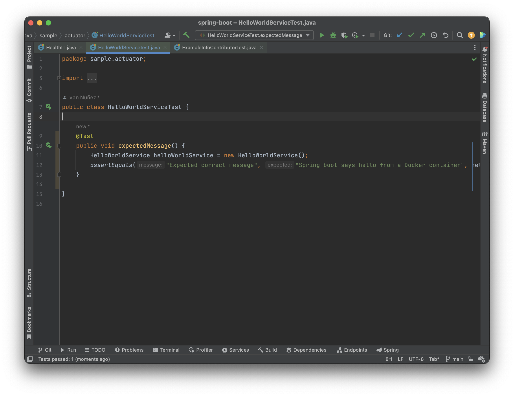
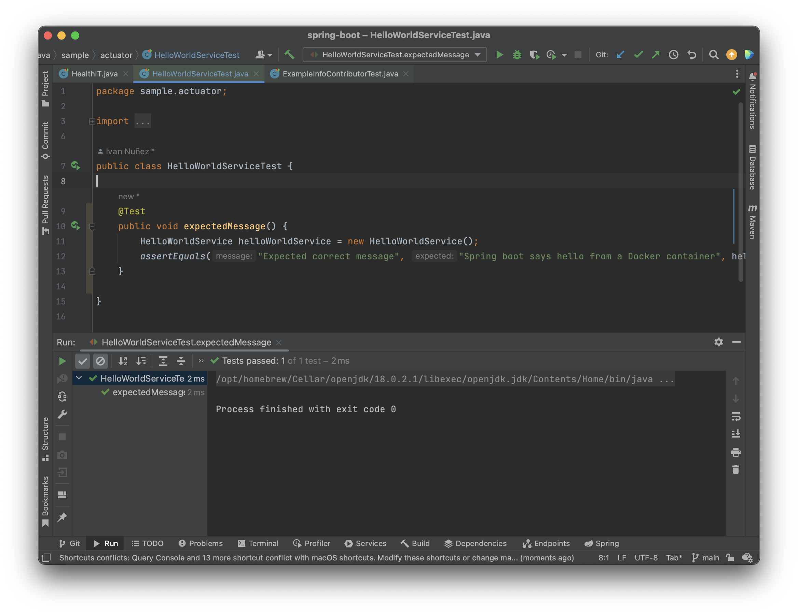

# Trabajo Práctico N°9

## Unidad 09: Pruebas de Unidad

### Ejercicio 1

`spring-boot-starter-test` es un conjunto de librerías para poder arrancar
a hacer testing en aplicaciones Spring Boot. La lista de librerías es
opinionada pero son aquellas que se utilizan comunmente en los proyectos
para empezar de manera sencilla y rápida a escribir tests. Dentro de la misma
nos encontraremos con:

- [JUnit](https://junit.org/junit5/): el estándar de facto para pruebas
unitarias de aplicaciones Java.
- [Spring Test](https://docs.spring.io/spring-framework/docs/current/reference/html/testing.html)
& Spring Boot Test: utilidades y soporte de tests de integración para
aplicaciones en Spring Boot.
- [AssertJ](https://joel-costigliola.github.io/assertj/): una librería de
asserts fluida.
- [Hamcrest](https://hamcrest.org/JavaHamcrest/): una librería de matcheo de
objetos (restricciones o predicados).
- [Mockito](https://site.mockito.org/): un framework de mocks en java.
- [JSONassert](https://github.com/skyscreamer/JSONassert): una librería de
asserts para JSON.
- [JsonPath](https://github.com/json-path/JsonPath): XPath para JSON.

1. Se declara el método `public void expectedMessage()`
de prueba unitaria.
2. `@Test`: la anotación del método público, le indica a
junit que el método puede ser ejecutado como un caso de
prueba.
3. Se crea una instancia de la clase `HelloWorldService`.
- Se utiliza la función `assertEquals(mensaje, expected, actual)`
para comprobar que la llamada al método `getHelloMessage()`
del servicio sea igual a `"Spring boot says hello from a Docker container"`.
4. En caso de error el corredor de pruebas mostrará el
mensaje escrito en `assertEquals()`.
`"Expected correct message"` en este caso.

### Ejercicio 3

- La clase `ExampleInfoContributor` implementa la interface `InfoContributor`
la cual se satisface contando con el método `contribute` que requiere al parámetro `Info.Builder builder`.

- Estas clases `Info.Builder` y `InfoContributor` vienen de la librería
spring boot actuator (`spring-boot-sample-actuator` dentro del `pom.xml`).
Los actuators ofrecen funcionalidades listas para en entorno de producción.
Supervisan la aplicación, recopilan métricas, comprenden y analizan el
tráfico y el estado de nuestra base de datos. También ofrecen la posibilidad
de exponer información operacional sobre nuestra aplicación en ejecución
(`/health`, `/metrics`, `/info`, `/dump`, `/env`, etc.). Por ende, esta
implementación (`ExampleInfoContributor`) busca sobreescribir el
funcionamiento base del `InfoContributor`.

- En el test `ExampleInfoContributorTest` dentro del método
`public void infoMap()` se utiliza mockito para crear una instancia falsa
de una implemetación de la clase `Info.Builder`. Se intancia una clase de
`ExampleInfoContributor` y se utiliza su método `contribute(builder)`
utilizando a la instancia falsa como argumento.

- Finalmente, se utiliza el método `verify()` de mockito para testear la 
cantidad de veces que se llama un método. En este caso, en nuestro test
como no se pasa segundo argumento a `verify` se entiende que verifica que el
método `withDetails(any(), any())` se ha llamado una única vez con cualquier
argumento.