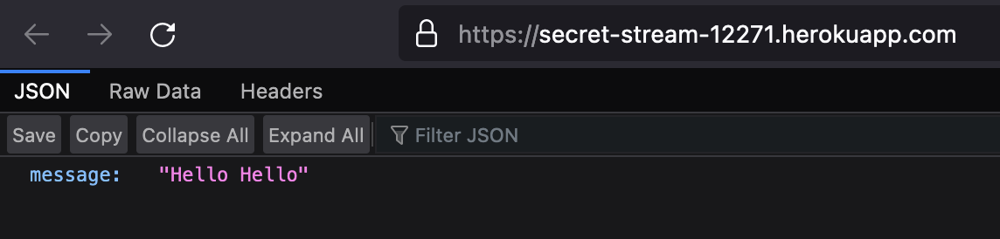

# Trabajo Práctico N°11

## Unidad 10: Despliegue de Aplicaciones

### Ejercicio 1

Cuenta en [heroku](heroku.com):


### Ejercicio 2

- Nombre por defecto de la aplicación: `secret-stream-12271`.

```console
$ heroku create
Creating app... done, ⬢ secret-stream-12271
https://secret-stream-12271.herokuapp.com/ | https://git.heroku.com/secret-stream-12271.git
$ heroku container:push web --app=secret-stream-12271
latest: digest: sha256:9c07f594e97ea6e523a9918dabad0c2059620542a9c38388d6040b72342478d5 size: 1577
Your image has been successfully pushed. You can now release it with the 'container:release' command.
$ heroku container:release web --app=secret-stream-12271
Releasing images web to secret-stream-12271... done
```

El dyno de heroku no funciona por tener Apple Silicon.
Hay que constuir la imagen para amd64.

```Dockerfile
FROM --platform=linux/amd64 openjdk:8-jre-alpine
```

Aplicación en [Heroku](https://secret-stream-12271.herokuapp.com/)



# Ejercicio 3

[Jenkins file](../files/11/03-Jenkinsfile.groovy)
